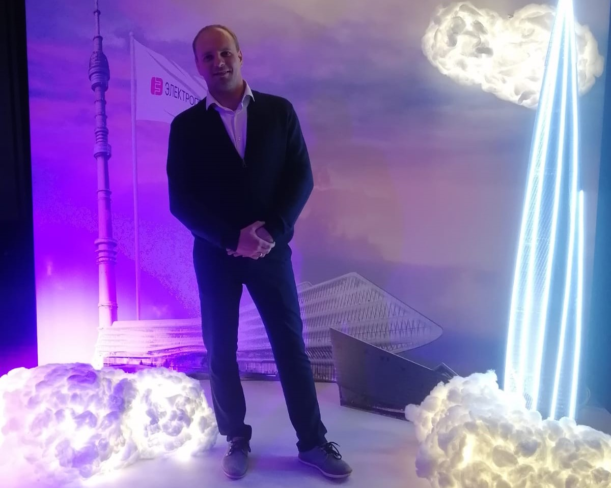
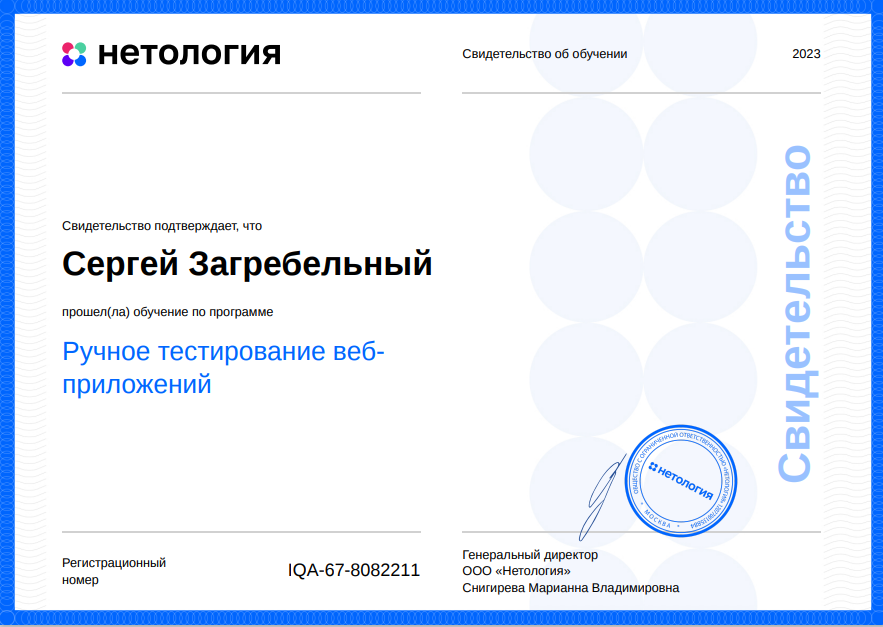

# Загребельный Сергей

**Профессия**

QA-инженер

**Ключевые навыки**

- Ручное тестирование ПО
 - Написание тестовых сценариев
 - Тест-кейсов
 - Тестовых планов
 - Чеклистов
 - Баг-репортов
 - Отчётов о тестировании
 - Тестирование API
 - Тестирование клиент-серверного взаимодействия
- Работа с приложениями:
   - Баг трекер Jira
   - Postman
   - Git
   - GitHub

**Контакты**

*Телефон:* +7(911)1442247
*e-mail:*  zagrebelny.s.v@gmail.com

